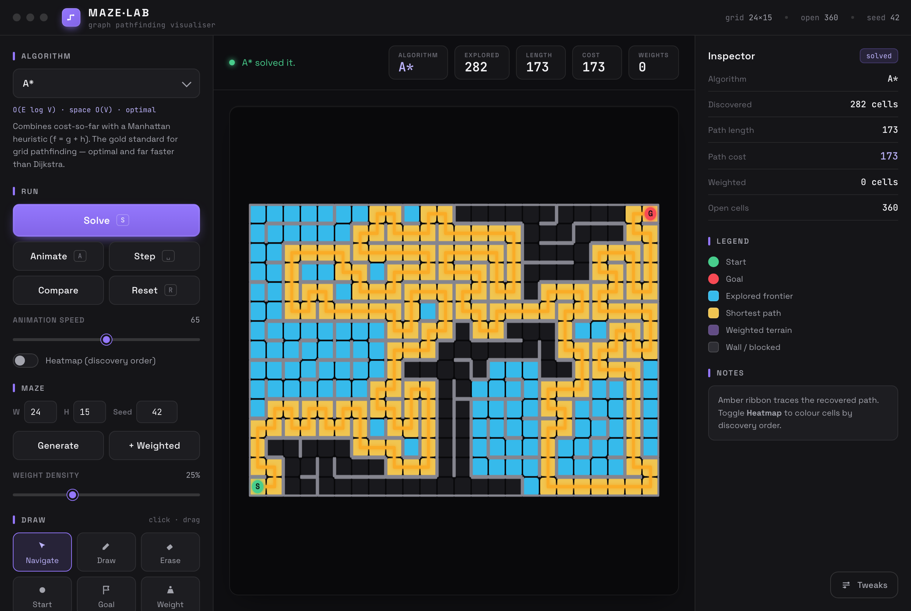
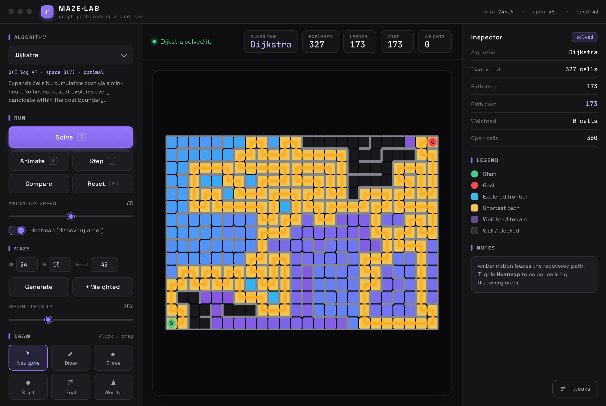
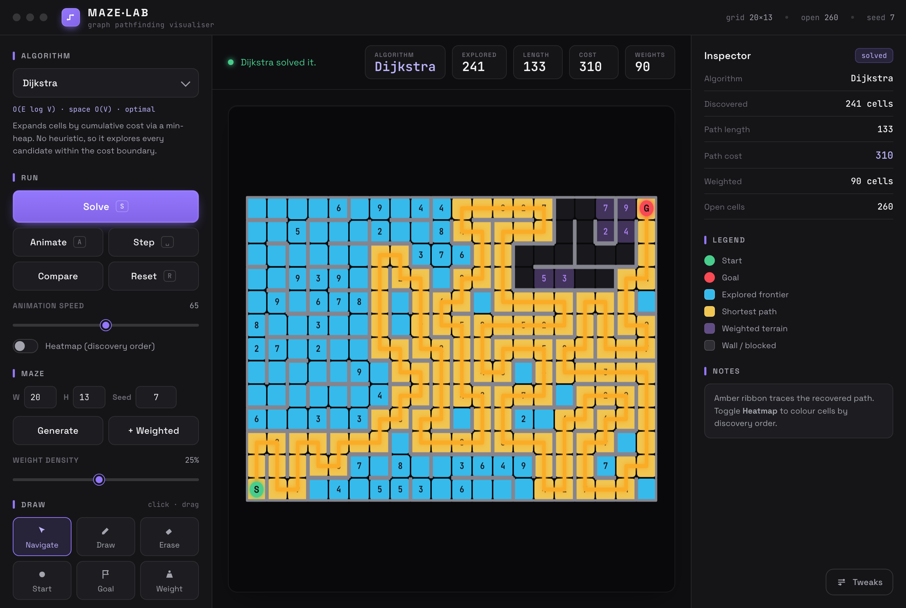
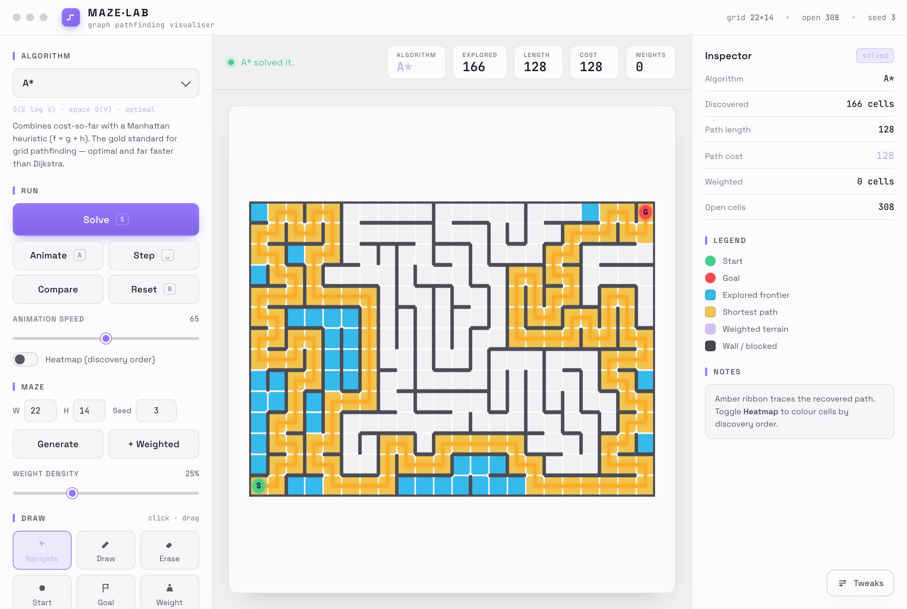

# Graph Maze Pathfinder

Python maze solver and visualiser built around graph search algorithms. The
maze is modelled as a graph: cells are nodes, valid moves are edges, and
weighted cells affect path cost.

The project includes a polished web-based desktop app, a dependency-free
Tkinter GUI, a command-line runner, generated mazes, weighted terrain, file
import/export, and unit tests for the core logic.

<p align="center">
  
  <br>
  <em>The desktop app (<code>python3 desktop.py</code>) — A* with its explored frontier and shortest path.</em>
</p>

## Key Skills Demonstrated

- Graph algorithms: BFS, DFS, Dijkstra, Bellman-Ford, Greedy Best-First, A*
- Data structures: graphs, queues, stacks, priority queues, parent maps
- GUI development with Tkinter
- Object-oriented Python design
- Unit testing with `unittest`
- File parsing, JSON save/load, CSV/text export
- Algorithm analysis and comparison

## Features

- Visual maze solving with animation, step mode, and algorithm comparison.
- Maze generation with optional weighted cells.
- Canvas editing tools for walls, start, goal, and weights.
- Support for text maze files and saved generated maze files.
- CSV/text export of explored cells, final path, cost, and runner actions.
- No third-party runtime dependencies in the core engine.

## Screenshots

| Discovery-order heatmap | Weighted terrain (Dijkstra) |
| :---: | :---: |
|  |  |
| Cells coloured by the order they were visited. | Numbered cells cost more to enter; the path routes around them. |
| **Algorithm comparison** | **Light stage theme** |
|  |  |
| Every algorithm run on the same maze, ranked by cells explored. | Accent colour and stage theme are switchable at runtime. |

## Algorithms

| Algorithm | Purpose | Optimality |
| --- | --- | --- |
| BFS | Shortest path by number of steps | Optimal for unweighted mazes |
| Bidirectional BFS | BFS from start and goal at the same time | Optimal for unweighted mazes |
| DFS | Depth-first exploration | Not optimal |
| Dijkstra | Weighted shortest path | Optimal for non-negative weights |
| Bellman-Ford | Weighted path by edge relaxation | Optimal, slower on this grid type |
| Greedy Best-First | Heuristic-first search | Not optimal |
| A* | Cost + Manhattan heuristic | Optimal with positive movement costs |

## Requirements

- Python 3.10+
- Tkinter, usually included with Python

The project uses only the Python standard library.

## Run

Start the Tkinter GUI (pure standard library, no dependencies):

```bash
python3 maze_gui.py
```

Open the polished web UI as a native **desktop app** (recommended). This renders
`web/index.html` in a real application window via [pywebview](https://pywebview.flowrl.com/):

```bash
python3 -m pip install pywebview   # one-time, optional dependency
python3 desktop.py                 # or:  python3 maze_runner.py --web
```

The desktop shell ships a faithful JavaScript port of the same seven algorithms,
so it runs fully offline with no backend process. Or just open `web/index.html`
directly in any browser.

Run from the command line:

```bash
python3 maze_runner.py sample_mazes/maze1.mz --algorithm astar
python3 maze_runner.py sample_mazes/weighted_maze.mz --algorithm dijkstra
python3 maze_runner.py --generate 20 12 --seed 42 --algorithm bidirectional
```

Supported algorithm names:

```text
astar, dijkstra, bellmanford, greedy, bidirectional, bfs, dfs
```

The CLI writes output to `sample_output/`:

- `exploration.csv`: visited cells in order.
- `statistics.txt`: path length, cost, route, and runner actions.

## GUI Controls

- `Solve`: run the selected algorithm.
- `Animate`: show visited cells and runner movement.
- `Step`: advance the search one visited cell at a time.
- `Compare`: run all algorithms on the current maze.
- `Generate`: create a connected maze from a seed.
- `+ Weighted`: generate a maze with weighted cells.
- `Draw`, `Erase`, `Start`, `Goal`, `Weight`: edit the maze directly.

Shortcuts:

```text
S      solve
A      animate
Space  step
R      reset view
Esc    stop animation
```

Shortcuts are ignored while typing into input fields.

## Tests

```bash
python3 -m unittest discover -s tests
```

Current tests cover:

- maze parsing
- generated maze save/load
- generated wall editing
- shortest path correctness
- weighted path selection
- generated maze connectivity
- path-to-runner-action conversion

## File Formats

### `.mz` text mazes

```text
#######
#S..2G#
#.###.#
#.....#
#######
```

- `#`: blocked cell
- `.` or space: open cell
- `S`: start
- `G`: goal
- `1`-`9`: weighted cell cost

If start or goal is missing, the defaults are bottom-left and top-right.

### `.maze` generated mazes

Generated mazes are saved as JSON-backed `.maze` files. This preserves internal
wall segments, weighted cells, start, and goal exactly.

## Structure

```text
graph_algorithms.py   search algorithms and SearchResult
maze.py               maze model, parsing, generation, save/load
maze_gui.py           Tkinter GUI
maze_runner.py        command-line interface and exports
runner.py             runner orientation and movement actions
desktop.py            native desktop shell for the web UI (pywebview)
web/                  HTML/CSS/JS front-end + JavaScript port of the engine
sample_mazes/         sample maze files
sample_output/        example output files
tests/                unit tests
pyproject.toml        project metadata and entry points
```

## Design Notes

- The maze, algorithms, GUI, and runner movement logic are separated.
- Both GUI and CLI use the same `SearchResult` object.
- Weighted algorithms use the cost of entering a cell.
- Generated mazes are connected using randomized DFS carving.
- The editor supports both blocked-cell mazes and generated wall mazes.

## License

Released under the [MIT License](LICENSE).
